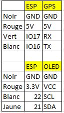
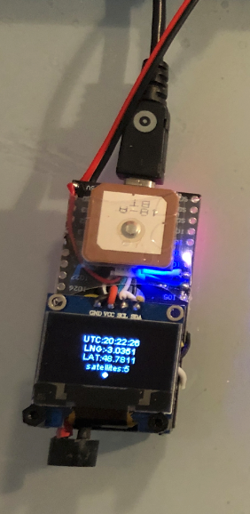

# GPS_Tracker_ESP32

Utilise la version 1 de droneID_FR : https://discuss.ardupilot.org/t/open-source-french-drone-identification/56904/98

Affiche la vitesse max, trés utile pour faire des mesures de vitesse

### Face avant 

#### Code du buzzer

* tick = phase de recherche de satellites
* Beep = un satellite de +
* Beep Beep Beep = enregistrement des coordonnées de départ
